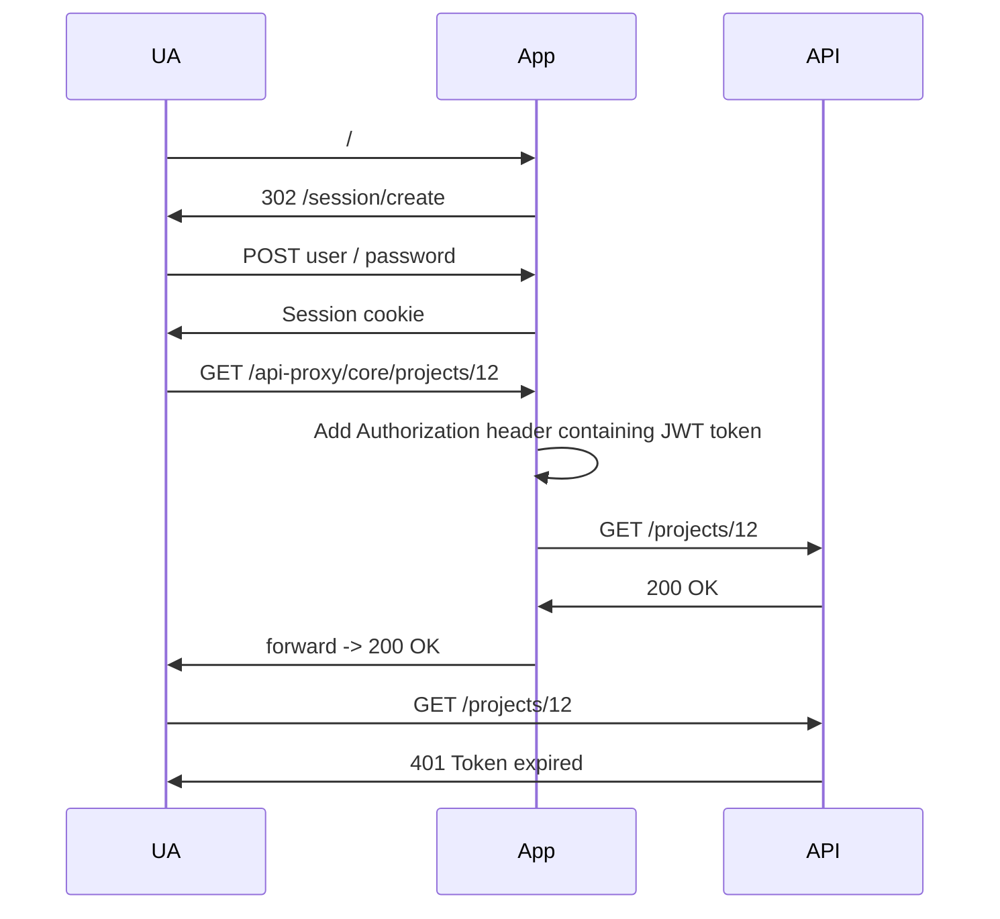

# Authentication flow for API 

The API is moved from a Yii2 Module to a separate Yii2 app.
This has several benefits:
- Cleaner configuration leading to better security
- Localized dependencies
- Easier testing 

## Securely storing access tokens
Since browsers cannot securely store access tokens we must use an authentication method that does not require this.
Since for the core web application we're using server-side sessions, we'll store the access token inside it.
This is simple and secure. Any API requests will be routed through the server using a simple proxy controller.

## Auth tokens
Auth tokens will be JWT tokens, the App will sign them using a shared secret with the API. In the future we will move to 
asymmetric signing using a private key instead.
