	
Introduction
============

Welcome to the **HeRAMS User Guide**. This user guide was designed for users of the `HeRAMS platform <https://herams.org/user/login/>`_. It provides step-by-step instruction on how to register and access the platform as well as a brief overview on key components of the platform, including detailed information on how to explore the available data using the interactive dashboards. Data managers can find additional information on how edit data in the `Edit Data`__ section.
For more advanced topics related to user management and project administration, please consult the `Project Administration`__ section.

.. __: `Edit Data`_
.. __: `HeRAMS Administration`_

It should be noted that the guide only addresses issues related to the `HeRAMS platform <https://herams.org/user/login/>`_. 
For general information on the HeRAMS approach and for technical guidance please consult the official `WHO HeRAMS webpage <https://www.who.int/hac/herams/en//>`_. For additional questions that are not covered in this guide, please contact the `HeRAMS Support Team <mailto:herams@who.int?>`_.

Getting started
===============

Creating a User Account
--------------------

This chapter provides step-by-step instructions on how to access the `HeRAMS platform <https://herams.org/user/login/>`_, create a user account and update your user profile.

1. To register as a new user, open the link `herams.org <https://herams.org>`_ in your browser.

.. tip:: It is strongly recommended to either user FireFox or Chrome.

2. On the sign-in page, click the `sign up <https://herams.org/user/register/>`_ link located just above the |login| button.

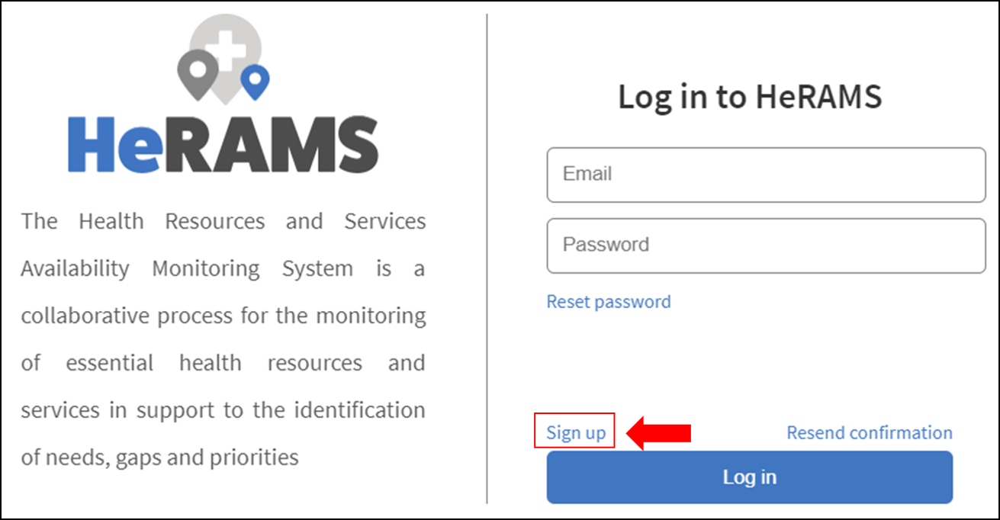

3. On the page that opens, enter your details.
4. Submit your information by clicking the |sign-up| button.
5. A confirmation email will be sent to the email address you entered.
   
.. tip:: If you don't receive a confirmation email within a few minutes, check your spam folder.

6. Confirm your registration by clicking the link in your email.

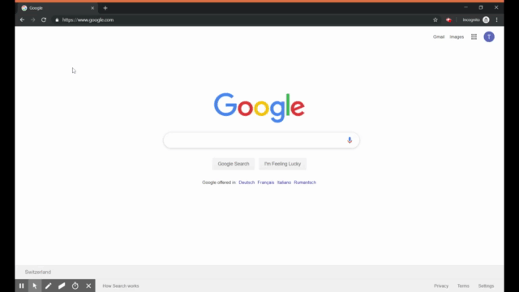

Logging in
----------

.. note:: New users without an existing account, will have to register before being able to login to the HeRAMS platform. To create a user account, follow the instruction `here`__.

.. __: `Creating a User Account`_

1. Open the link `herams.org <https://herams.org>`_ in your browser.
2. Enter your email address and password in the designated fields.
3. Click the |login| button.

.. tip:: It is strongly recommended to either user FireFox or Chrome.

Logging out
-----------

To logout click the |logout| button in the top right corner of the screen.

Reset password
--------------

In case you forgot your password, the instruction below will guide you through the steps to reset your password.

1. Open the link `herams.org <https://herams.org>`_ in your browser.

.. tip:: It is strongly recommended to either user FireFox or Chrome.

2. On the sign in page, click the `reset password <https://herams.org/user/forgot/>`_ link located below the password field.
3. Enter your email address in the top field.
4. Below the email field, you will see an image similar to this one: |captcha|
5. Enter the the characters displayed into the field below the image.
6. Click the |submit| button.
7. You will receive an email with a password reset link. Click the link to open the password reset page. 

.. note:: If you did not receive this email within a few minutes, check your spam folder.

7. On the page that opens, enter your new password.
8. Click the |submit| button to confirm your new password.
9. To login into HeRAMS, return to the `sign in page <https://herams.org/user/login/>`_.

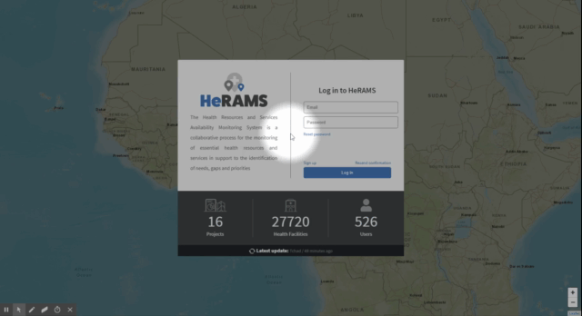

Update your User Profile
------------------------
Each user has a profile associated with their account. This permits you do to customize your profile, change your email address or password without requiring additional support.

1. To update your user profile or account details, click your username shown on the top right corner of the page.
2. This opens your `user profile <https://herams.org/user/settings/profile>`_ and allows you to change your personal information such as your name, organization and contact details.

.. note:: First name, last name and organization are mandatory fields.

Change Password
---------------

1. To alter your password, open your user profile as explained `above`__.
2. Click on the `Account <https://herams.org/user/settings/account>`_ link to access your account information.
3. On the page opening, you should be able to change your email address and enter a new password.
4. Make sure to click the |submit| button to confirm your changes.

.. __: `Update your User Profile`_

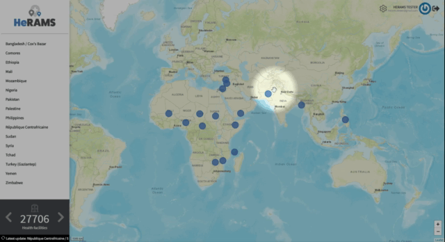

World map
=========

After logging in, you will see a world map with several blue dots. Each of these dots represents a HeRAMS project.
You can also see the list of all available projects in the navigation pane on the left. 
In addition, a brief summary on the number of projects available in HeRAMS, the total number of contributors and health facilities is shown in the bottom left corner.

1.	To learn more about a project, either click the blue dot on the world map or select the project from the navigation pane on the left.
2.	You should now see a pop-up window displaying an overview of the selected project. In the upper part of the pop-up you can see the project name, the number of health facilities assessed as well as the number of contributors. The lower half of the pop-up window displays a brief summary on the distribution of health facility types, their functionality and service availability.
3.	For further details, click the |details| button. This will open the project dashboard.
	
.. tip:: Access to the project dashboards is restricted to selected users. If you would like to be granted access to a project dashboard, please contact your country focal point or send an email to `herams@who.int <mailto:herams@who.int?>`_ specifying your function and role as well as a brief explanation why you would like to access the dashboard.

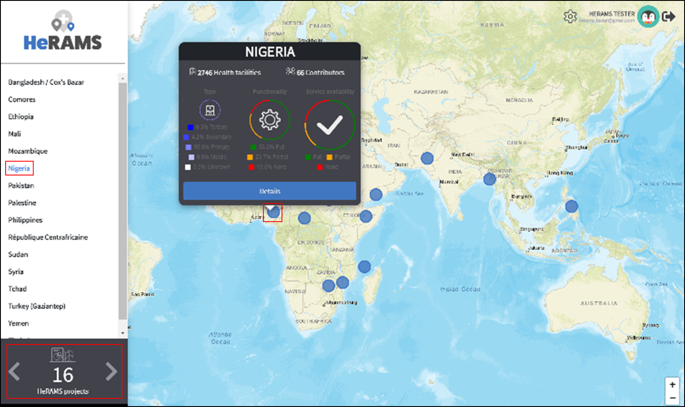

Project Dashboard
=================

Each project in HeRAMS has a custom interactive dashboard providing an instant and in-depth analysis based on the available data.

1. To view a project dashboard, open the project summary by selecting your project from the navigation pane on the left. Alternatively, you can open the project summary by clicking the corresponding blue dot on the world map.
2. In the pop-up window, click the |details| button. This will open the interactive dashboard.
3. You should now see a page similar to the one shown below. In the navigation pane on the left you will find a list of all available pages.
    
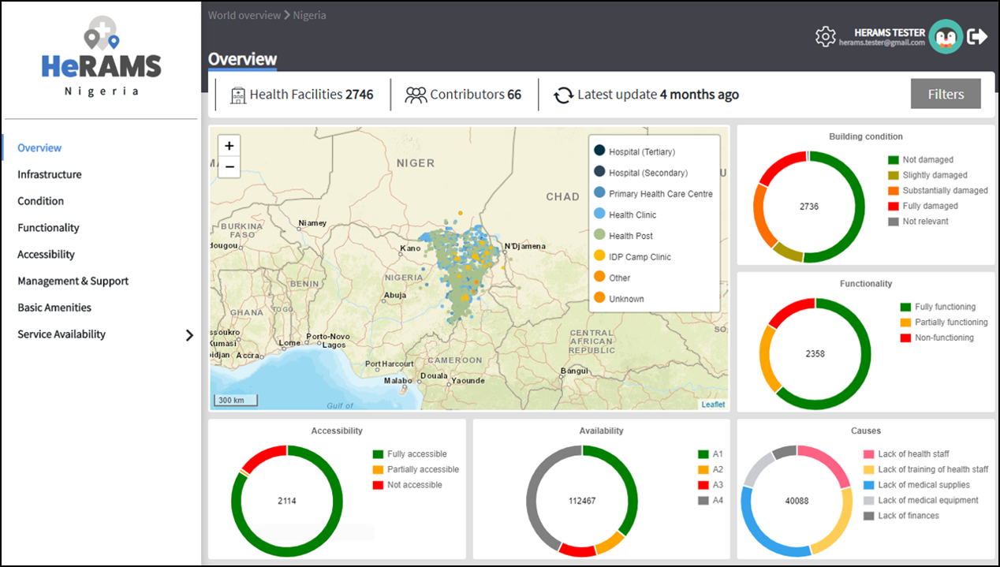

4. To open a page, click the page name in the navigation pane.

.. tip:: Some pages may contain a sub-page, indicated by a |forward| icon next to the page's name.

5. To return to a previous page, you can either select the page in the navigation pane on the left or use the breadcrumb trail on top of the dashboard. For example, the image below displays a sub-page of the Nigeria dashboard. 
To return to the first page of the dashboard, click on **Nigeria** in the breadcrumb trail.

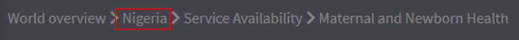

The animation below shows the dashboards in action.

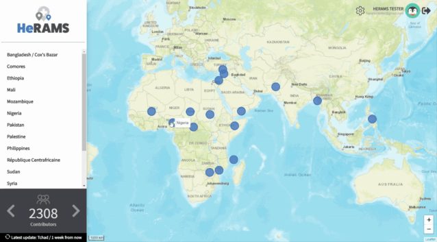

Filtering data
--------------

Data on the dashboard can be filtered. This allows you to scrutinise the data subsets that are of interest to you.

.. note:: Filtering is not persistent and only visible during your current session.

1. In the top right corner of the dashboard, click the |filter| button.
2. You should now see the filtering setting page. Use the drop-down list to select your filter criteria. Repeat this process until you have added all the desired filter criteria.

.. note:: If you apply multiple search criteria, only results that contain all terms will be shown.

.. tip:: You can limit the number of fields displayed using the search field on top of the page.

3. Click the |applyfilter| button to activate your filter.
4. To remove the filters, return to the **Filter** pages and click the |clearfilter| button.

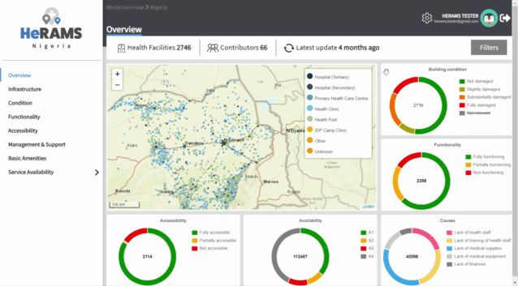

Customizing the dashboard
-------------------------

This section provides a few tips and tricks on how to customize the dashboard and view additional details.

Tooltips
~~~~~~~~

If you hover with your mouse over a point on a map or a chart, a small pop-up message will appear, displaying additional details.

Adjust the Map Zoom Level and Focus Area
~~~~~~~~~~~~~~~~~~~~~~~~~~~~~~~~~~~~

You can adjust the zoom level of a map by using the scroll button on your mouse. To change the focus area of a map, position you mouse in the map element. Right click (hold) and drag the map in the desired direction. This will move the map focus area.

Remove a Category from Charts or Maps
~~~~~~~~~~~~~~~~~~~~~~~~~~~~~~~~

By clicking the icons in the legend, you can remove a category from a chart or map. To add it again, simply click the circle again.

Reorder map layers
~~~~~~~~~~~~~~~~~~

Depending on the zoom level applied to a map, it may happen that several points lie on top of each other, hiding some facilities. To bring a specific category to the front, uncheck the category in the legend. This will remove the category from the map. If you add the category again (click the now empty circle), the category will be added on top of the other points.

.. image:: media/vid/HeRAMS_dashboard_customize_maps.gif
   :height: 300px

Default dashboard pages
-------------

The below section provides an overview of the standard pages available in a dashboard. Each page refers to a HeRAMS standard information pillar.

.. note:: The order and the content of dashboards are customized individually based on each project's need. Your dashboard might, therefore, be substantially different from the example pages displayed below.

Overview
~~~~~~~~

The **Overview** page provides a summary, in form of:

*	a map to spot the distribution and number of health facilities by level of care (i.e. primary, secondary and tertiary health care facilities); and
*	donout charts to summarize different indicators, such as level of damage, functionality status, accessibility and service availability in the assessed health facility.

.. note:: The service availability indicator is country-specific. Thus, direct comparisons from one country to another should be avoided.

Infrastructure
~~~~~~~~~~~~~~

The **Infrastructure** page displays a descriptive analysis, including:

* a map to spot the distribution and number of health facilities by type;
* donout charts to illustrate **Mo**\des of **S**\ervice **D**\elivery (**MoSD**\s) by type as well as the modality of the building structure (permanent vs. temporary); and
* a table to illustrate reported accessibility barriers.

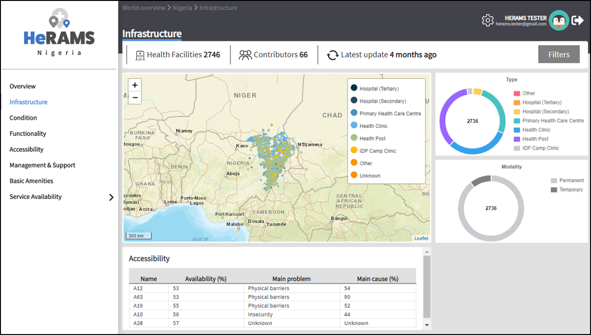

Condition
~~~~~~~~

The **Condition** page displays the level of reported damage to MoSD buildings following a standard classification and scale (Not Damaged to Fully Damaged). Information is visualized as:

*	a map to spot the distribution and number of health facilities according to the level of building damage (i.e. condition);
*	donout charts summarizing the reported level of building damage by level of severity as well as the distribution of MoSD by type; and
*	a table to provide the name of the prioritized localities in terms of damage and their main causes.

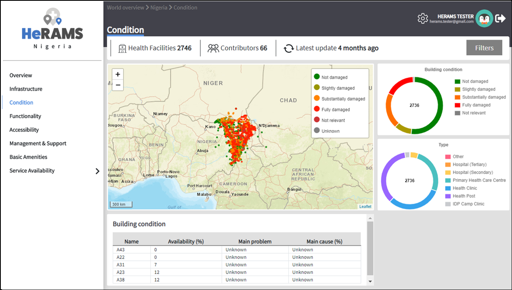
   
Functionality
~~~~~~~~~~~~~

The **Functionality** page displays the level of functionality of the MoSDs following a standard classification and scale (Fully Functioning to Not Functioning) represented as:

*	a map to spot the distribution and number of MoSDs according to the functionality status;
*	donout charts to summarize the level of functionality as well as main causes of non-functionality; and
*	a table displays the list of priority areas in terms of non-functional health facilities and reported causes.

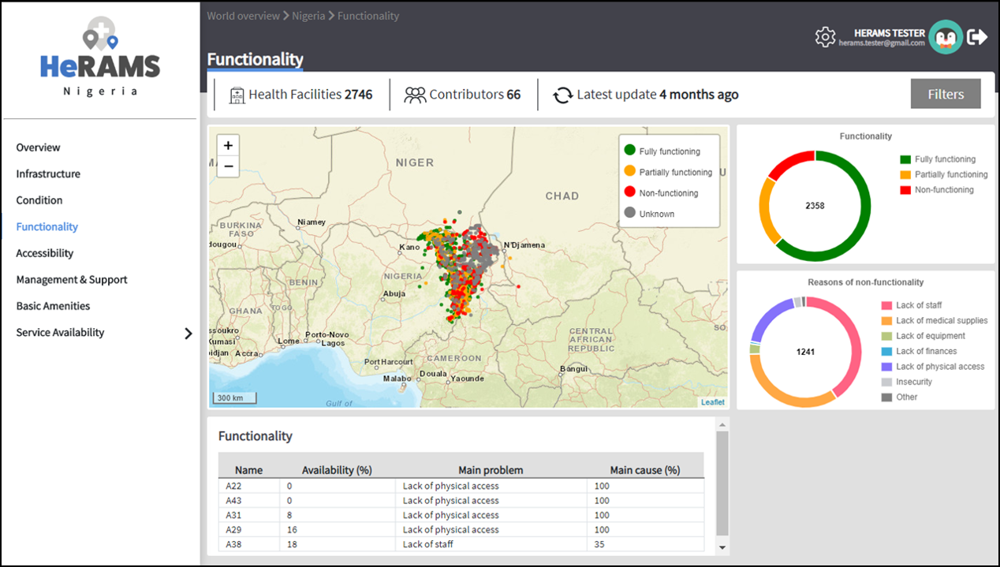
   
Accessibility
~~~~~~~~~~~~~

The **Accessibility** page displays the level of accessibility to MoSDs following a standard classification and scale (Fully Accessible to Not Accessible) in the form of:

*	a map to spot the distribution and number of MoSDs according to the accessibility status;
*	donout charts to summarize the level of accessibility per number of MoSDs as well as the reported causes of inaccessibility per number of MoSDs; and
*	a table displays the list of priority areas with inaccessible MoSDs and the main reported cause of inaccessibility.

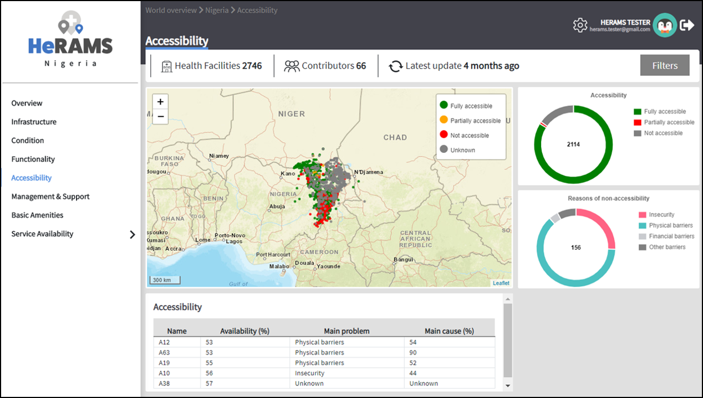
   
Management & support
~~~~~~~~~~~~~~~~~~~~

The **Management & support** page displays information on the management of the MoSDs and the level of support provided by partners. The information is illustrated in terms of:

* Ownership:

  * A map to spot the distribution of MoSDs according to their ownership (i.e. public, private, faith-based and, NGO/iNGO).
  * A donut chart to highlight the categories of ownership as a percentage of the total number of MoSDs.

* External support:

  * A donout  chart to illustrate the level of support provided by partners.

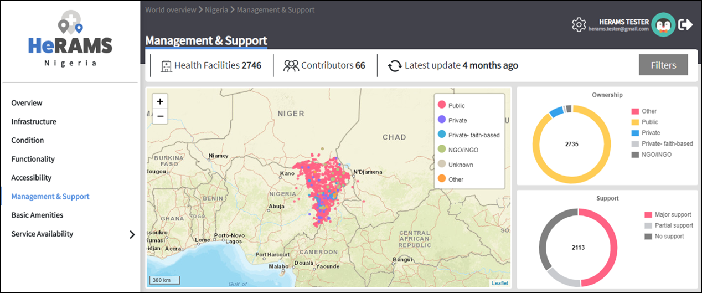
   
Basic Amenities
~~~~~~~~~~~~~~

Information on **Basic Amenities** is presented in a series of subpages. Each subpage is dedicated to a particular category and includes:

* a map displying the availability and sufficiency of the basic amenity; and
* donut charts highlighting the percentage of MoSDs with sufficient availability of the amenity as well as main sources.

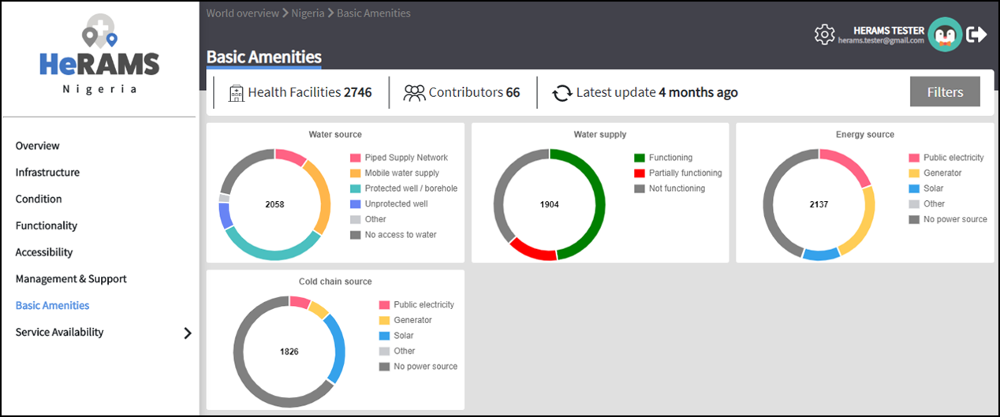
   
Service Availability
~~~~~~~~~~~~~~~~~~~~

The **Service Availability** page displays multiple pages per type of service. Each page displays:

*	a map to spot the distribution of the MoSDs providing the selected health service;
*	donout charts to summarize the level of service availability as well as the underlying causes of unavailability of the service; and
*	a table displaying the list of priority areas per service unavailability and the main reported underlying causes.

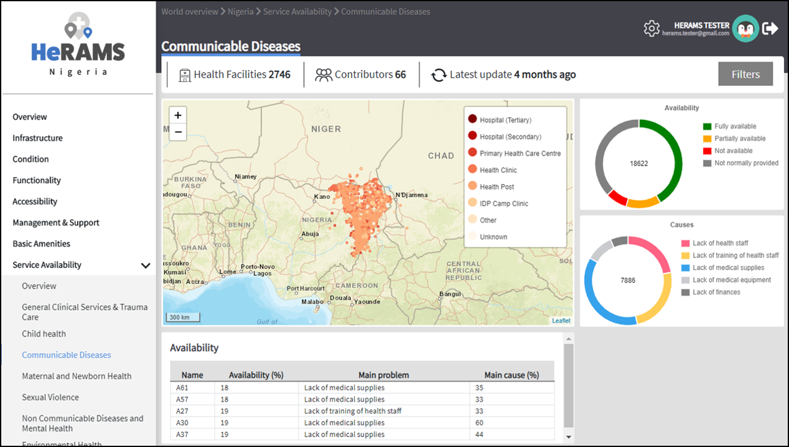

Edit Data
=========

This chapter is itended primarily for data managers responsible to update the HeRAMS data. It covers all aspects related to data editing, including registering new health facilities, updating the status of exisiting health facilities as well as deleting erroneous records (e.g. duplicates). 

.. note:: Access to the data edit interface is limited to users responsible to update the data. If you require your access permissions to be changed, kindly contact your country focal point or send an email to `herams@who.int <mailto:herams@who.int?>`_ specifying your function and role as well as a brief explanation on why you would like your access permissions to altered.

Access the Data Update Interface
--------------------------------

1. Open the admin interface by clicking the |settings| button on the top right corner of the page (next to your username). 
2. From the navigation pane on the left, select `Projects <https://herams.org/project/index>`_.
3. You should now see a table of all available projects. For each project, the table displays the number **Workspaces**, **Contributors**, **Health facilities** and **Responses**.
  
.. tip:: The number of responses can be higher than the total number of health facilities. This indicates that a health facility was assessed multiple times.

4. In the last column of the table, click the |workspace| icon. This will open a new page displaying a list of all available workspace.

.. note:: HeRAMS uses so-called **Workspaces** to manage access permission to the underlying data. A workspace might represent, for example, a specific organization or a geographic region. For more information on **Workspaces** click `here`__.

.. __: `workspaces`_

5. To view the health facilities that are part of a specific workspace, click the |update-data| icon in the Action column.
6. Use the |forward-page| buttons to move to the next page or filter the workspaces by typing the workspace name in the field below the header row.

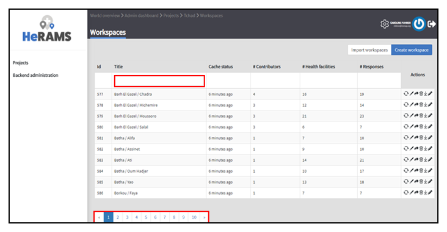
   
7. You should now see a table with all the health facilities of the selected workspace.

The video below summarizes the steps to access the data entry interface.

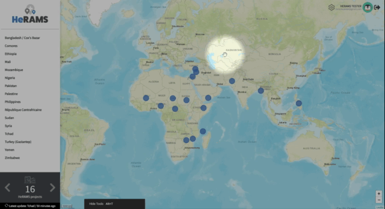
   

Edit a Health Facility Record
-----------------------------

.. Caution:: Editing a record will overwrite the existing record. If you would like to update the status of a health facility while keeping the history of changes, follow the instructions in the section below.

1. Open the data update interface as outlined `above`__.
2. To edit a record, click the |pencil-blue| icon in the left most column.

.. __: `Access the Data Update Interface`_

  
.. tip:: Keep in mind that the table might have multiple pages. Use the button in the bottom right corner to advance to the next page. You can also reduce the number of records displayed by applying filters.

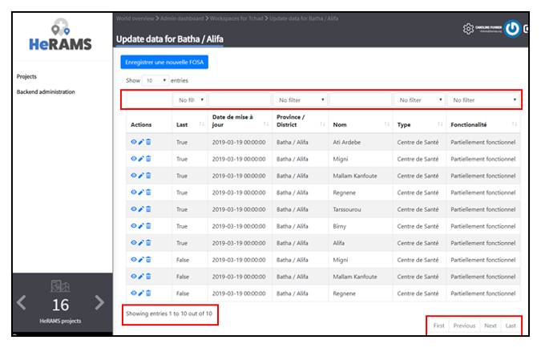
   
3. You should now be able to edit the selected record. Use the |next| buttons in the lower right corner to move to the next page of the questionnaire or return to the previous page. You can also use the navigation pane on the left to access a specific section of the questionnaire.
4. Make sure to validate and save your changes before exiting the record. To save your changes, navigate to the last page, **Validate**, and click the |submit| button.
5. If you would like to discard your edits, click the |clear| button in the lower right corner of the page.

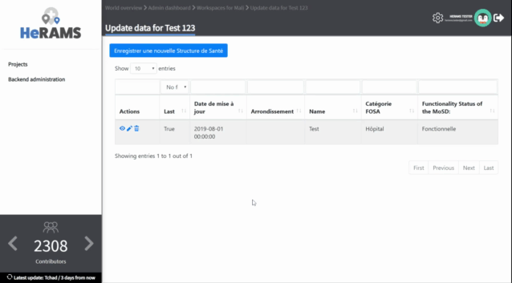

Update a Health Facility Record
-------------------------------

If HeRAMS is used as a monitoring tool, you can record changes to a health facility while keeping the existing information.

.. note:: The feature to update health facilities is not enabled in all projects. Contact your country focal point or send an email to `herams@who.int <mailto:herams@who.int?>`_ for further information.

1. To update the status of a health facility, use the |update-blue| button to open the record.
2. You should now be able to edit the selected record. Use the |next| buttons in the lower right corner to move to the next page of the questionnaire or return to the previous page. You can also use the navigation pane on the left to access a specific section of the questionnaire.
3. Make sure to validate and save your changes before exiting the record. To save your changes, navigate to the last page, **Validate**, and click the |submit| button.
4. If you would like to discard your edits, click the |clear| button in the lower right corner of the page.

Register a New Health Facility
------------------------------

1. To create a new record, click the button |new-record|.
2. You should now be able to edit the selected record. Use the |next| buttons in the lower right corner to move to the next page of the questionnaire or return to the previous page. You can also use the navigation pane on the left to access a specific section of the questionnaire.   
3. Make sure to validate and save your changes before exiting the record. To save your changes, navigate to the last page, **Validate**, and click the |submit| button. 
4. If you would like to discard your edits, click the |clear| button in the lower right corner of the page.

Delete a Health Facility Record
-------------------------------

1. To delete a record, click the |delete-blue| icon in the first column.

.. Warning:: Deleting records cannot be undone. Be careful when deleting a record.

Download Data
=============

It is possible to download part of the data as **CSV** for further in-depth analysis. In rare cases, permissions could be granted to download the entire data set. To download the entire data set please follow the instructions `here`__, otherwise see the section below.

.. __: `Download the Entire Data Set`_

Download Workspace Data
-----------------------

Follow the instructions below to download data for a single workspace. If you require data from multiple workspaces, follow the below steps for each workspace. You can then merge the data in your analysis tool of choice.

.. note:: In order to download data, you will require access to your workspace. Contact your system administrator to elevate your access rights if needed.

1. Navigate to the workspace page of your project (see `Access the Data Update Interface`__ steps 1 - 4 for detailed instructions).
2. In the rightmost column, click the |download| button. This will download all records of this workspace.

.. __: `Access the Data Update Interface`_
  
.. tip:: For surveys in languages other than English, make sure to correctly define the encoding when opening the data in Excel (see `Data Encoding in Excel`__ for details).

.. __: `Data Encoding in Excel`_

Download the Entire Data Set
----------------------------

.. note:: Users are advised to download data for individual workspace as outlined above. The permission to download the entire data set is restricted to a few users. Contact your system administrator for further information.

*Coming soon*

Data Encoding in Excel
----------------------
If data is downloaded for further analysis in Excel or a statistical software of choice (e.g. R or STATA), data encoding should always be set to UTF-8.

.. tip:: Encoding issues are particularly prevalent in languages with special character and can result in the data being unreadable. For example, instead of **camp de réfugiés** you get **Camp de réfugiés**.
The below instructions guide users through the steps to define the data encoding in Excel. 

1. Open a new Excel file.
2. On the Data tab in the **Get & Transform Data** group, click **From Text/CSV**.
3. In the **Import Data** dialog box, locate and double-click the text file that you want to import, and click **Import**.
4. In the top left corner of the pop-up window that opens, change the encoding type to **UTF-8**, and click **Import**.

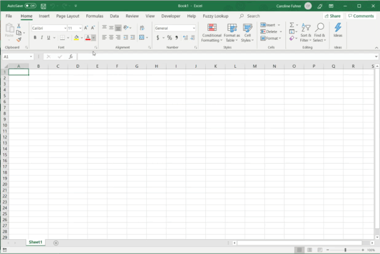

HeRAMS Administration
=====================

This chapter provides an overview of the admin pages in HeRAMS and offers step-by-step instructions for common tasks performed by advanced users and project administrators. The first part of the chapter introduces the concept of `Workspaces`__ while the second part focuses on `Project`__ level administration and the configuration of project specific `Dashboard`__.

 .. __: `Workspaces`_
 .. __: `Projects`_
 .. __: `Project Dashboard`_

.. note:: If you require your permissions to be changed, kindly contact your country focal point or send an email to `HeRAMS Support Team <mailto:herams@who.int?>`_ specifying your function and role as well as a brief explanation of why you would like your access permissions to altered.

Workspaces
----------

HeRAMS uses the concept of workspaces to manage user permissions. Each workspace consists of several health facilities and has a dedicated focal point responsible for updating these records. A workspace might, for example, include all MoSDs of a geographical region, MoSDs managed by a specific partner or any other logical category. Thus, the use of workspaces in combination with different levels of permissions (see below) assures granular, role-based access control to a project and the underlying data. While most users only have access to a single workspace, project administrators might have access to several or all workspaces.

* |refresh| **Refresh Data Cache**: This button allows users to manually refresh the data cache of a workspace. Data is automatically refreshed every 30 minutes. This means if a record is updated, the changes are not immediately reflected on the dashboard. Thus, by manually refreshing the data cache of a workspace the time lag limitation can be overcome and the changes made will become visible immediately.
* |pencil-thin| **Update Workspace**:  allows to change the title or token of a workspace.
* |share-icon| **Share Workspace**: To grant a user access to workspace, the workspace must be shared with the user. For more information on how to add users to a workspace click `here`__.
* |delete-black| **Delete Workspace**: Permanently removes a workspace from a project. See `Delete a Workspace`__ for more information.
* |download| **Download Data**: Downloads all records belonging to the selected workspace. See `Download Data`__ for more information.
* |pencil-black| **Data Update**: This opens the data edit interface. More information on data editing and updating is available `here`__.
  
.. __: `Add a User to a Workspace`_
.. __: `Delete a Workspace`_
.. __: `Download Data`_
.. __: `Edit Data`_

.. note: The number of buttons visible to users depends on your access rights and might vary from one workspace to another.

Workspace Permissions
~~~~~~~~~~~~~~~~~~~~

There are two permission levels for workspaces:

1. access to manage the underlying responses’ data; and
2. full access (includes editing the workspace properties, token and responses’ data).

Users with the role of **Data Editor** have access to update the response data (option 1) while **Workspace Owners** might be given elevated permission (option 2) allowing them to add additional users to their workspace as well as to manage the underlying response data.

Add a User to a Workspace
~~~~~~~~~~~~~~~~~~~~~~~~

1. To grant a user access to a workspace, open the admin interface by clicking the |settings| icon in the top right corner of the screen.
2. In the navigation pane on the left, click `Projects <https://herams.org/project/index>`_ to open the **Projects** overview table. 
3. In the rightmost column of the table, you should see several **Action** buttons. Click the |workspace| icon. This will open the workspace of the selected project.
4. You should now see a table with all workspaces of your project. For each workspace the table provides information on the last time data was synced with the underlying database, the number of contributors, health facilities and responses. Alike the **Projects** table, the last column contains several **Action** buttons.
5. To grant a user access to a workspace (e.g. to update the data), you have to share the workspace with them. Click the |share-icon| icon in the **Actions** column.
6. You should now see a page similar to the image below. On the bottom half of the page, you can see a list of all users currently having access to the workspace including their permission level. In the top half of the page, you have the option to add a new user. Start typing the user’s name in the top field. You will notice that the list of available users dynamically filters as you are typing. Select the user you would like to add.
  
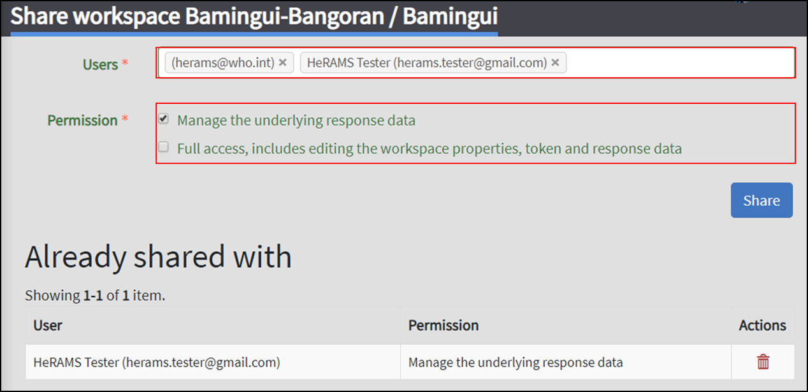
   
  .. tip: You can add multiple users add once as shown in the image above.

  .. note: If you cannot find a user, it means the user has not yet created an account. Ask the user to create an account by registering on the HeRAMS platform and then retry. Should the issue persist, contact your system administrator or send an email to `herams@who.int <mailto:herams@who.int?>`_.

7. Use the checkboxes to select the appropriate permission level. See `above`__ for further details on workspace permissions.
8. Click the |share-button| button to share the workspace with the selected user(s).

.. __: `Workspace Permissions`_

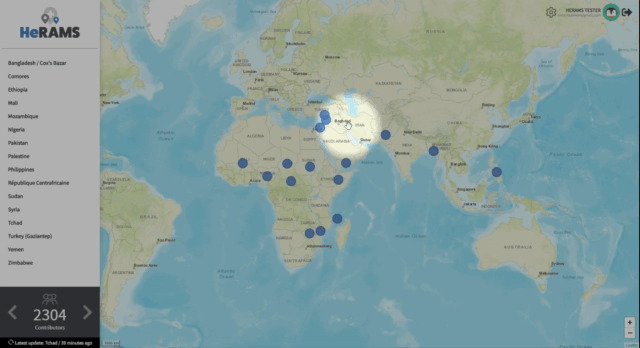

Remove a User from a Workspace
~~~~~~~~~~~~~~~~~~~~~~~~~~~~~~

1. To remove a user from a workspace, navigate to the workspace from which you would like to remove the user. (Follow steps 1 - 5 outlined `above`__ to access the workspace).
2. On the second half of the page you will see a list of all users having access to the workspace. Click the |delete-black| icon to remove the user permanently.

.. __: `Add a User to a Workspace`_

Change a User's Workspace Permission
~~~~~~~~~~~~~~~~~~~~~~~~~~~~~~~~~~~~

1. To change a user's permission, remove the user from the workspace as outlined `above`__
2. Now add the user again using the new permission level (see `Add a User to a Workspace`__ for details).

.. __: `Remove a User from a Workspace`_

.. __: `Add a User to a Workspace`_

Create a New Workspace
~~~~~~~~~~~~~~~~~~~~

1. To create a new workspace, access the workspace page of your project. (Follow steps 1 - 5 outlined `above`__ to access the workspace).
2. In the upper left corner, you will see a button labelled |create-workspace|.
3. On the page that opens, you should now be able to create a new workspace.
4. Enter the workspace's name into the title field.
5. Use the dropdown list to select the corresponding **Token** or create a new token by selecting **Create new token**.

.. __: `Add a User to a Workspace`_
   
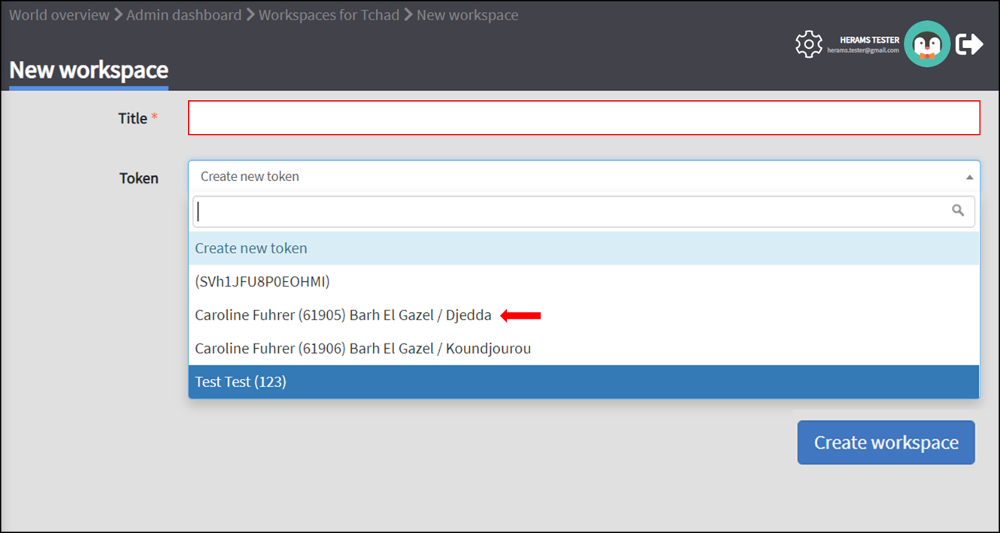
     
  .. Note: Tokens are unique identifiers that link health facilities to workspaces. To add a health facility to a workspace the token of the record in question has to be manually changed. Contact your system administrator for guidance on how to change a record's token.

Delete a Workspace
~~~~~~~~~~~~~~~~~~~

1. You can remove a workspace by clicking the |delete-black| icon in the **Actions** column next to the selected workspace.
   
  .. note: Deleting workspace will not affect the underlying data. See the `Delete a health facility`__ to learn how to permanently a record from your project.

   .. __: `Delete a Health Facility`_

Projects
--------

The `Projects <https://herams.org/project/index>`_ page provides a brief overview of all projects available on the HeRAMS platform. 

  .. image:: media/img/HeRAMS_projects.png
  	:height: 300px
	:align: center
	
* |workspace| **Workspaces**: This opens the list of all available workspace belonging to the project. See `here`__ for more information on workspaces. 
* |dashboard| **Dashboard**: By clicking the dashboard icon, the project `dashboard`__ will be opened.
* |pencil-thin| **Edit Project Properties**: Permits users with specific permission to alter the project properties as well as to configure the project dashboard. See `Modify a Project`__ for more information on editing the project properties. For additional information on how to configure the dashboard, consult the section `Configure the Project Dashboard`__.
* |check| **Check Data**: Can be used for a quick review of the data to identify invalid responses.
* |share-icon| **Share**: The sharing function is used to grant users access to a project. See `below`__ for further details.

.. __: `Workspaces`_   
.. __: `Project Dashboard`_
.. __: `Modify a Project`_
.. __: `Configure the Project Dashboard`_
.. __: `Add a User to a Project`_

  .. note: The number of buttons visible to users depends on your access rights to a specific project is likely to vary from one project to another.

Add a User to a Project
~~~~~~~~~~~~~~~~~~~~~~~~

1. To grant a user access to a specific project, open the admin interface by clicking the |settings| button in the top right corner of the screen.
2. In the navigation pane on the left, click `Projects <https://herams.org/project/index>`_ to display the list of all available projects.
3. In the last of the table, you have several action buttons. Click the |share-icon| icon.
4. You should now see a page similar to the image shown below. On the bottom half of the screen you can see a list of all users currently having access to this project and their permission level. In the top half the page you have the option to add a user. Start typing the users name in the top field. You will notice that the list of users is dynamically filtering. Select the user you would like to add.

  .. image:: media/img/HeRAMS_project_share.png
  	:height: 300px
	:alt: share project
	:align: center

  .. tip: You can add multiple users add once as shown in the image above.

  .. note: If you cannot find a user, it means the user has not yet created an account. Ask the user to create an account by registering on the HeRAMS platform and then retry. Should the issue persist, contact your system administrator or send an email to `herams@who.int <mailto:herams@who.int?>`_.

5. Use the checkboxes to select the appropriate permission level. See `above`__ for further details on project level permissions.
6. Click the |share-button| button to share the project with the selected user(s).

.. __: `Project Permissions`

  .. image:: media/vid/HeRAMS_project_share.gif
    :height: 300px
    :alt: share project
    :align: center
    
    
Remove a User from a Project
~~~~~~~~~~~~~~~~~~~~~~~~~~~~~~

1. To remove a user from a Project, follow steps 1-3 outlined in the `previous section`__ to access the project sharing page.
2. On the second half of the page you will see a list of all users having access to the workspace. Click the |delete-black| icon to remove the user permanently.

.. __: `Add a User to a Project`_

Change a User's Project Permissions
~~~~~~~~~~~~~~~~~~~~~~~~~~~~~~~~~~~~

1. To change a user's permission, remove the user from the project as outlined `above`__
2. Now add the user again using the new permission level (see `Add a User to a Project`__ for details).

.. __: `Remove a User from a Project`_
.. __: `Add a User to a Project`_

Modify a Project
~~~~~~~~~~~~~~~~~~

1. To modify the project properties, open the admin interface by clicking the |settings| button in the top right corner of the page.
  
2. Open the **Projects** page by selecting `Projects <https://herams.org/project/index>`_ in the navigation pane on the left.
3. Click the |pencil-thin| icon in the **Actions** column of your project. This will open the project properties page.
4. You should now see a page similar to the one displayed below, which permits you:
	* to update the project title;
	* to alter the survey linked to this project;
	* to change the centroids (latitude and longitude) of the blue dot shown on the world map;
	* to update the status of the project;
	* to configure the pop-up information displayed on the main page; and
	* to configure the project dashboard. Additional information on how to configure the project dashboard is available `here`__.
5. Make sure you save your changes by clicking the |update-project| button.

.. __: `Configure the Project Dashboard`_	

Configure the Project Dashboard
-------------------------------

For each HeRAMS Project, an interactive dashboard can be configured providing summarizing key indicators and findings of a project. This section provides project administrators with a detailed description on how to edit these dashboards. An overview of the standard dashboard pages is available `here`__.

.. __: `Default dashboard pages`_
   
   
Modify an Existing Dashboard Element
~~~~~~~~~~~~~~~~~~~~~~~~~~~~~~~~~~~~

Users with the permissions to edit dashboards can modify charts and maps directly from within the dashboard.

 .. tip: To modify the order of dashboard pages or rename a page, see `here`__.
   .. __: `Update a Dashboard Page`_
   
1. Open the dashboard and navigate to the element you would like to change.
2. In the top right corner of the element you would like to change, you should see a |pencil-thin| icon. Right-click the icon to open the element's configuration page.
3. You should now be able:
	* to change the variables displayed;
	* to change the colors of a map or a chart; and
	* to rename the element.

  .. note: See the section `below`__ for further details on how to create and modify dashboard elements.

    .. __: `Add a New Element to a Page`_

4. Save your changes by clicking the |update-element| button.

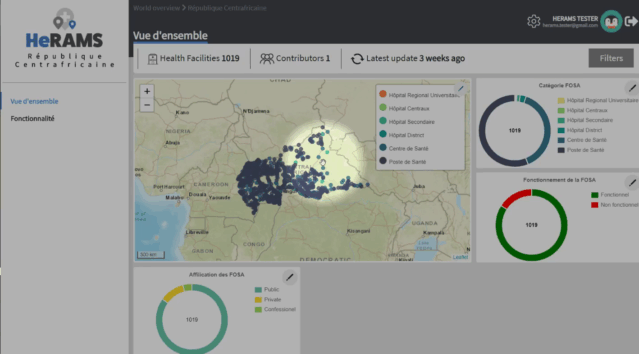

Add a New Element to a Page
~~~~~~~~~~~~~~~~~~~~~~~~~~

This section covers the steps required to add a new element to an existing dashboard page. If you would like to extend your dashboard by adding additional pages, please see `Add a New Page to a Dashboard`__ for further information.

.. __: `Add a New Page to a Dashboard`_

1. Open the Project's property page (Follow steps 1 - 3 in the `Modify a Project`__ section.
2. In the bottom half of the page you will see a list of all available dashboard pages. For each page, the table displays the:
	* page ID;
	* title;
	* parent page; and 
	* sort ID.

.. __: `Modify a Project`_

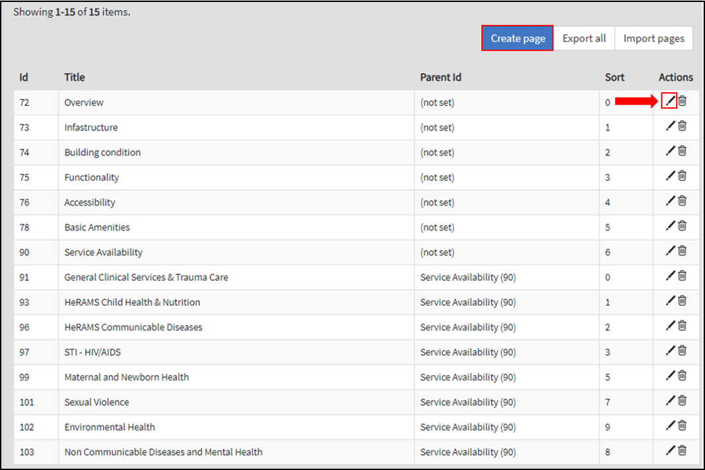

3. Open the page you would like to modify using the |pencil-thin| icon next to the page's name. 
4. In the bottom half of the page, you should see the following three buttons |create-elements|. Select the type of element you would like to add by clicking the corresponding button.
5. You should now see a page similar to the one displayed below.

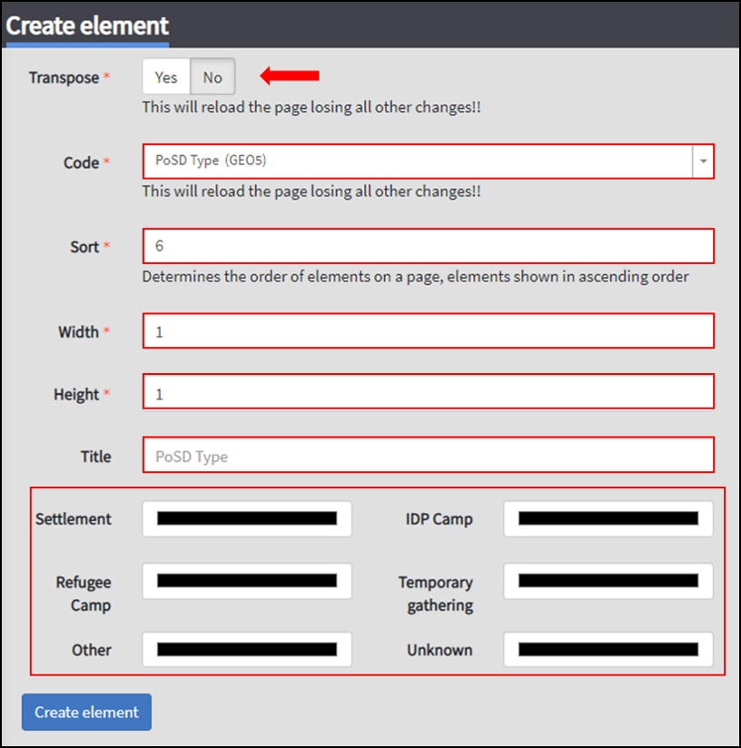
	
6. The **Transpose** feature allows to switch between aggregating data at the health facility and the health service level. Set the feature to **No** to display data aggregated at the health facility level.
7. Now use the **Code** dropdown list to select which field you would like to display on your element.

  .. tip: Transposing the element or changing the question code or will reload the page making you lose all other unsaved edits.

8. Define the element position on the dashboard page by specifying the **Sort** index. Increment the index by 1 for each new item, starting with 0 for the first page.
9. The **Width** and **Height** fields allow to create a custom-sized element.

  .. tip: For charts with large legend elements, it is recommended to use a **Width** of 2 to assure the legend is displayed correctly.

10. Optionally, the **Title** field allows you to overwrite the default title.
11. For **Maps & Charts**, The bottom half of the page, displays the list of pre-defined answer options of the selected question. Click the color next to the category name. This will opens a color picker allowing you pick custom colors.
12. For **Maps**, you can further specify the size of the dots by increasing/decreasing the  **Marker Radius**.

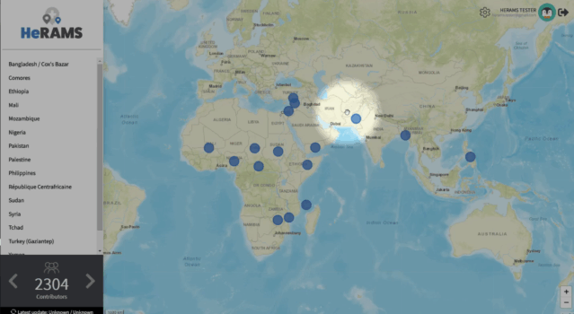

13. For **tables**, two additional fields will be displayed to specify the **Reason Code** and **Group Code**.

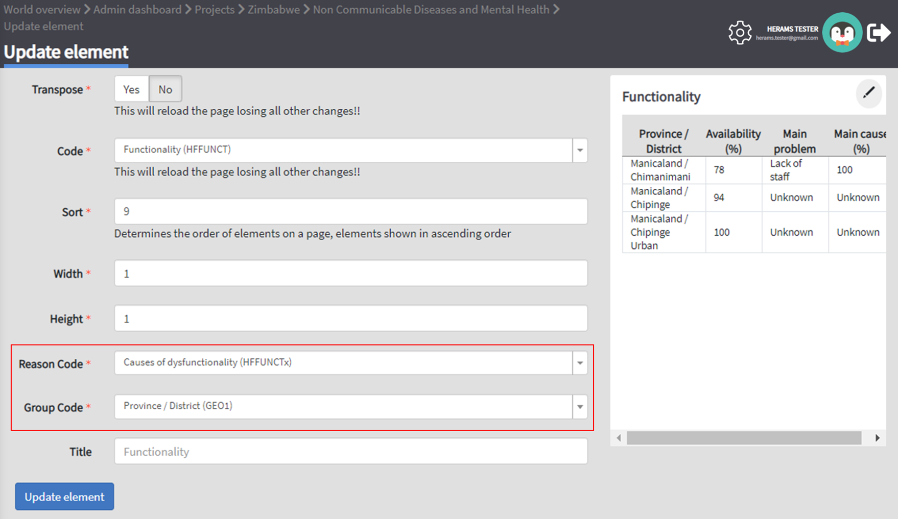

14. Finally, click the |create-element-blue| button to add the element to the dashboard page.

Remove an element from the dashboard
~~~~~~~~~~~~~~~~~~~~~~~~~~~~~~~~~~~~

1. Open the Project's property page (Follow steps 1 - 3 in the `Modify a Project`__ section.
2. In the bottom half of the page you will see a list of all available dashboard pages. Click the |pencil-thin| icon to open the page you would like to modify.
3. In the lower half of the page you will see a list of all elements displayed on the dashboard page. Use the |delete-black| to permanently delete the element.

.. __: `Modify a Project`_

  .. warning:: Be careful when deleting dashboard elements. Deleted elements cannot be restored.

Add a New Page to a Dashboard
~~~~~~~~~~~~~~~~~~~~~~~~~~~~~~

1. To add a new page to a dashboard, open the Project's property page. (Follow steps 1 - 3 in the `Modify a Project`__ section.
2. You should now see a page similar to the one displayed below.

.. __: `Modify a Project`_

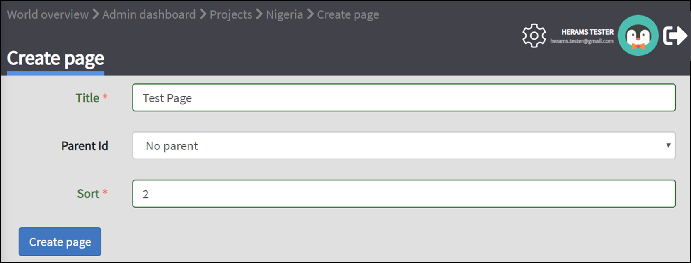

3. Enter the page name in the top field.
4. For sub-pages, select the parent page from the **Parent Id** drop-down list. For all other pages select **No parent**.
5. Define the page order by entering a **Sort** index. Increment the index by 1 for each new page, starting with **0** for the first page.
6. Click the |create-page| button to add the page to the dashboard.
7. If you return to the previous page, you will see the page appearing in the list of available pages.

  .. note: You only created an empty page. To add elements to your page, see section `Add a New Element to a Page`__.
  
    .. __: `Add a New Element to a Page`_

Update a Dashboard Page
~~~~~~~~~~~~~~~~~~~~~~~~

1. To alter an existing page, click the |pencil-black| icon next to the page's name. This will open the page's settings. You are now able to change the title and the order of the page. See `above`__ for further details.
2. On the page that opens, you should now be able to alter the page name and the display order.
3. Save your changes by clicking the |update-page| button.

.. __: `Add a New Page to a Dashboard`_

Delete a Dashboard Page
~~~~~~~~~~~~~~~~~~~~~~~~

1. To delete a dashboard page, open the Project's property page. (Follow steps 1 - 3 in the `Modify a Project`__ section.
2. In the list of available page, use the |delete-black| icon next to the page you would like to delete.

.. __: `Modify a Project`_

  .. warning:: Be careful when deleting pages or elements. Deleting dashboard pages will permanetly delete the page including potential sub-pages. 

FAQ
===

This section aims to help users troubleshoot frequently encountered issues. In case you encounter an issue that is not addressed here, please contact your country administrator or send an email to `hearms@who.int <mailto:herams@who.int?>`_.

* `General`_

  * `Confirmation email not received`_
  * `How to reset your password?`_
  
* `View a project/dashboard`_

  * `Can't access a project dashboard`_
  * `Who has access to your project?`_
  
* `Data editing & downloading`_

  * `Data updates don't appear on the dashboard`_
  * `Exported data is unreadable / contains strange characters`_
  
 
General
-------

Confirmation email not received
~~~~~~~~~~~~~~~~~~~~~~~~~~~~~~

If you did not receive an email upon registering or resetting your password, follow the steps below to troubleshoot the issue. 

1. Refresh your inbox. It might take a few minutes for the email to appear. 
2. Check your spam/junk folder. 
3. Try to register again. You might have accidentally misspelled your email. 
4. If the above steps did not solve your issue, please contact your system administrator or send an email to `hearms@who.int <mailto:herams@who.int?>`_.

How to reset your password?
~~~~~~~~~~~~~~~~~~~~~~~~~~

If you forgot your password, follow the instructions provided `here`__ to reset your password.

 .. __: `Reset password`_

View a project/dashboard
--------------

Can't access a project dashboard
~~~~~~~~~~~~~~~~~~~~~~~~~~~~~~

For data protection reasons, access to the project dashboards is only granted upon request. If you require access to a project, please contact your country focal point or send an email to `hearms@who.int <mailto:herams@who.int?>`_, specifying why you require access to the project.

Who has access to your project?
~~~~~~~~~~~~~~~~~~~~~~~~~~~~~~

In-country administrators and users responsible for a project or workspace can verify the list of users having access to the
project and/or workspace as well as their permission levels.
See `HeRAMS Administration`__ for more information on sharing `project`__ and `workspaces`__.
 
 .. __: `HeRAMS Administration`_
 .. __: `Projects`_
 .. __: `Workspaces`_

Data editing & downloading
-------------------------

Data updates don't appear on the dashboard
~~~~~~~~~~~~~~~~~~~~~~~~~~~~~~~~~~~~~~~~~~

It is important to note that the data displayed on the interactive dashboards are only synchronized every 30 minutes. Thus, is it is possible that updates to the data don't show immediately on the dashboards. To solve the issue, manually sync the data cache of the workspace. For more information on data caching read the section on `Workspaces`__.

 .. __: `Workspaces`_
 
Exported data is unreadable / contains strange characters
~~~~~~~~~~~~~~~~~~~~~~~~~~~~~~~~~~~~~~~~~~~~~~~~~~~~~~

If you open data downloaded from HeRAMS in Excel, you might experience an issue with special characters not displaying correctly, resulting in unreadable text. For example, instead of **camp de réfugiés** you get **Camp de réfugiés**. The reason for this is that Excel is not using the correct encoding type to read your data. To correct the issue, follow the instruction outlined `here`__.

 .. __: `Data Encoding in Excel`_

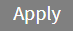

.. |captcha| image:: media/img/img_captcha.png
   :alt: HeRAMS Login
   :height: 1.5em
   :align: top

   

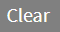

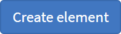
   
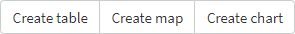

.. |create-page| image:: media/img/bt_create_page_blue   .png
   :height: 1.5em
   :alt: create-element
   :align: top
   
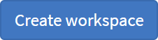

   

   
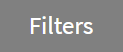
	

   

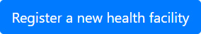

   

   

   
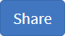
   

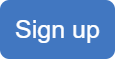
   

   

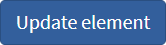

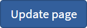
   
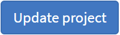

